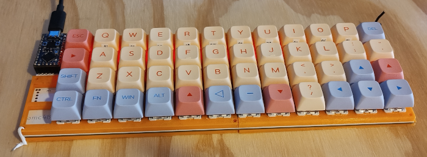
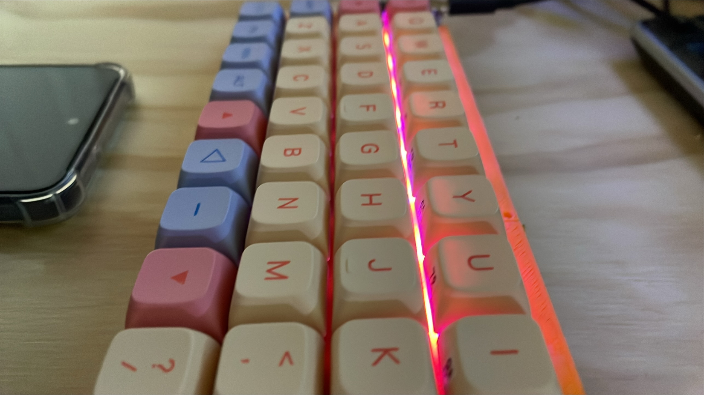

# AMC48K
48 key Ortholinear keyboard.

- RP2040 promicro.
- 48 RGB leds
- Rotary encoder
- 3D printed case, and plate.

# How to Build
- [Components](components/bom.md) required.
- [PCB](pcb/readme.md) created using kicad
- [Case](case/readme.md) 3d printed. Created using openscad.

# QMK Features
- Caps word  (tap both shift to activate next word caps lock)
- Mouse emulation
  - FN "Arrow keys" 
- Dynamic Macros: Record and Replay Macros in Runtime
  - Lower "a" record 1
  - Lower "z" play 1
  - Lower "s" record 2
  - Lower "x" play 2
  - Lower "d" Stop recording 

# Other stuff...

## RP2040 startup
[Double tap bootmode](https://docs.qmk.fm/#/platformdev_rp2040?id=double-tap)  This is enabled be default.

## ANSI vs ISO backslash
I use a UK (ISO) keyboard layout in the OS, however the keycaps are US (ANSI) style
- KC_NONUS_BACKSLASH	KC_NUBS	Non-US \ and |	✔	✔	✔
- KC_BACKSLASH	KC_BSLS	\ and |	✔	✔	✔
- KC_NONUS_HASH	KC_NUHS	Non-US # and ~	✔	✔	✔

## to do 
- Rotary encoder
